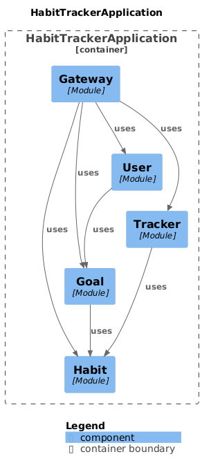

# Habit Tracker Application

Link to blog post: [Comprehensive Guide to Spring Modulith](https://szymonsawicki.net/comprehensive-guide-to-spring-modulith/)

## Overview

Habit Tracker is a modern, modular Spring Boot application designed to help users track their habits and achieve their goals. Built with a focus on clean architecture and modularity using Spring Modulith, this application provides a robust platform for personal development and habit formation.

## Architecture

The application follows a modular architecture pattern, with clear separation of concerns and domain boundaries. Each module is self-contained with its own database schema, ensuring loose coupling and high cohesion.

### Module Structure

```
├── gateway
├── goal
├── habit
├── tracker
├── user
```
#



### Key Components

- **Gateway Module**: Acts as the entry point for external requests
- **Goal Module**: Manages user goals and their relationships
- **Habit Module**: Handles habit definitions and management
- **Tracker Module**: Tracks habit execution and progress
- **User Module**: Manages user accounts and authentication

## Technical Stack

- **Java 23**
- **Spring Boot 3.3.4**
- **Spring Modulith 1.3.0**
- **Gradle** (Build Tool)
- **JPA/Hibernate** (Database Access)
- **Multiple Database Schemas** (One per module)

## Domain Model

### Core Entities

- **User**: Represents system users with their goals
- **Goal**: Represents user objectives
- **Habit**: Defines specific habits linked to goals
- **HabitExecution**: Tracks the actual execution of habits

### Data Transfer Objects

```java
public record GoalDTO(Long id, Long userId, String name, String description, List<HabitDTO> habits)
public record HabitDTO(Long id, Long goalId, Long userId, String name, String description, HabitPriority priority)
public record HabitExecutionDTO(Long id, Long habitId, Long userId, Integer durationMins, String comment, LocalDate executionDate, LocalTime executionTime)
public record UserDTO(Long id, String username, String password, UserType userType, List<GoalDTO> goals)
```

### Event-Driven Architecture

The application uses domain events for cross-module communication:
- UserDeleteEvent
- UserExistsEvent
- GoalExistsEvent
- HabitExistsEvent

## Module Communication

- **External APIs**: Exposed through the Gateway module
- **Internal APIs**: Used for inter-module communication
- **Event-Based Communication**: Used for handling cross-cutting concerns

## Getting Started

### Prerequisites

- JDK 23
- Gradle
- Your favorite IDE (IntelliJ IDEA recommended)

### Building the Project

```bash
./gradlew build
```

### Running the Application

```bash
./gradlew bootRun
```

### Loading of test data

For creating some test data, additional endpoint is created just execute POST request to: http://localhost:8080/test-data

In "documentation" directory you can find ready set of requests for testing purposes.

## License

This project is licensed under the MIT License - see the LICENSE file for details